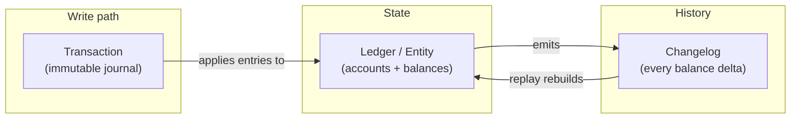

# How to Build a Ledger-as-a-Service Product Package

Most companies build a ledger three or four times before they build it once properly. The first one lives inside the payments service. The second is written by the wallet team, who needed stored value and could not get the payments team's roadmap. The third belongs to the B2B billing team, who needed unbilled/billed/settled balances and gave up waiting. By the time somebody asks "what is the company's cash position across all these systems?", nobody can answer, because each ledger rounds differently, retries differently, and has its own opinion about whether money can be created out of nothing.

Ledger-as-a-Service (LaaS) is the fix: build the financial primitives **once**, as a multi-tenant product, and let every team that needs balances and money movement rent them instead of rebuilding them.

This post is a build guide. It covers the invariants you cannot compromise on, the data model, the API surface, the multi-tenancy design, and — the part most engineering teams skip — the packaging that turns an internal library into a product other teams can actually adopt.

> Inspiration and prior art: Uber's payments platform ([*Zero Sum by Design: 10 Years of Uber's Payments Platform*](https://www.uber.com/blog/zero-sum-by-design/), August 2026) generalized its ledger primitives into a multi-tenant Ledger-as-a-Service that has run several tenants for 7+ years. The principles below are the durable, transferable ones: immutability, zero-sum accounting, strong consistency, and aggressive genericity.

---

## Table of contents

1. [What a "product package" means](#1-what-a-product-package-means)
2. [The invariant core: four rules you never break](#2-the-invariant-core-four-rules-you-never-break)
3. [The data model](#3-the-data-model)
4. [The API surface: your product contract](#4-the-api-surface-your-product-contract)
5. [Multi-tenancy: the part that makes it a service](#5-multi-tenancy-the-part-that-makes-it-a-service)
6. [Consistency and storage](#6-consistency-and-storage)
7. [The hot entity problem](#7-the-hot-entity-problem)
8. [Correctness operations: proving you are right](#8-correctness-operations-proving-you-are-right)
9. [Packaging it as a product](#9-packaging-it-as-a-product)
10. [A phased rollout plan](#10-a-phased-rollout-plan)
11. [Anti-patterns](#11-anti-patterns)
12. [Appendix: launch checklist](#appendix-launch-checklist)

---

## 1. What a "product package" means

An internal platform is not a service until a team can adopt it without talking to you. The package is everything a tenant needs to go from "we need balances" to "we are in production":

| Component | Deliverable |
| --- | --- |
| **Core** | Immutable journal, balance store, changelog |
| **Contract** | Versioned API, idempotency semantics, error taxonomy, consistency guarantees in writing |
| **Tenancy** | Self-service provisioning, config-as-data, isolation, quotas |
| **Clients** | SDKs in your top 2–3 languages, plus a sandbox environment with fake money |
| **Assurance** | Reconciliation jobs, invariant monitors, audit export, tamper-evidence |
| **Operations** | SLOs, on-call runbooks, per-tenant dashboards, cost/chargeback model |
| **Docs** | Accounting model guide, integration quickstart, migration/backfill playbook |

If you build only the first row, you have a library. Teams will fork it and you will be maintaining four ledgers again — this time with your name on all of them.

---

## 2. The invariant core: four rules you never break

These are the load-bearing decisions. Everything else in the system can be refactored; these cannot, because they are baked into every record you have ever written.

### 2.1 Immutability

A posted transaction is never updated and never deleted. Not for a typo, not for a bug, not for a "quick fix in prod."

Corrections happen by **writing a new transaction**: a reversal, an adjustment, a top-up. A trip fare was wrong? Post an adjustment transaction. A food order was missing an item? Post a partial refund transaction. The original record stands forever.

This buys you three things:
- **Self-auditability.** History is the sum of what happened, not the last state somebody left behind.
- **Safe replay.** You can rebuild any balance from the journal, which makes migrations, backfills, and disaster recovery tractable.
- **A real audit trail** for finance and regulators, without bolting on a change-data-capture pipeline later.

The engineering consequence: your storage layer needs **append-only semantics enforced at the write path**, not just as a convention. Convention loses to a 2 a.m. incident. Reject `UPDATE` and `DELETE` at the data-access layer, and make the underlying store append-only where you can.

### 2.2 Zero-sum, enforced before the write

Every transaction's entries must sum to zero, per currency/asset. Money is never created or destroyed inside your system — it only moves between accounts.

This is validated **pre-commit**. Not in a nightly job, not in a dashboard: the write is rejected.

A rideshare trip, modeled properly:

| Account | Direction | Amount |
| --- | --- | --- |
| `rider:8f3a/payable` | debit | 20.00 |
| `driver:1c7d/receivable` | credit | 16.00 |
| `platform:global/commission` | credit | 3.50 |
| `tax:AU-VIC/collected` | credit | 0.50 |
| **Sum** | | **0.00** |

Two related disciplines make this stick:

**Double-entry bookkeeping.** Every credit has a matching debit. If your API only lets a caller express balanced entries, zero-sum becomes structurally hard to violate rather than merely validated.

**Push the invariant upstream.** The hardest zero-sum failures do not come from the ledger — they come from the system that *computes* the amounts. If pricing hands you a fare breakdown that does not reconcile, you are just faithfully recording an inconsistency. Fix this by requiring upstream systems to submit **per-entity amounts that already sum to zero**, and rejecting the ones that don't. It is unpopular for a quarter and correct forever.

### 2.3 Strong consistency on balances

An eventually consistent balance is not a balance; it is a hint. The moment a balance authorizes anything — a wallet spend, a credit limit, a payout — you need read-your-writes and serialized mutation per account holder.

The classic implementation: **one row per entity, holding all of that entity's sub-accounts**, mutated with a conditional write (compare-and-swap on a version number). One row means the multi-account update is a single atomic write, and you never need a distributed transaction to keep two sub-accounts in agreement.

```
Entity row: entity_id = "user:8f3a", version = 4172
  ├── available      : +12.40 AUD
  ├── pending        :  -3.00 AUD
  ├── promo_credit   :  +5.00 AUD
  └── (accounts with a zero balance are pruned)
```

Two practical constraints fall out of this design, and you should document both as product limits from day one:

- **Row size.** Keep entity rows small (a kilobyte or so is a healthy target). Prune zero-balance sub-accounts aggressively, or a long-lived entity accumulates hundreds of dead accounts and your hot path starts reading a small novel on every request.
- **Per-entity write throughput.** A single row serializes writes. That is the point — and it is also the ceiling. See [§7](#7-the-hot-entity-problem).

### 2.4 Idempotency, everywhere

Every mutating call takes a caller-supplied idempotency key, and the ledger stores the key alongside the resulting transaction ID for a long retention window (90 days minimum; longer if your tenants do monthly batch retries).

Rules that avoid the classic disasters:
- Same key + identical request body → return the original result, `200`, no new transaction.
- Same key + **different** body → reject with a hard error. Never silently pick one.
- Keys are scoped per tenant, never global.

Without this, every network timeout is a potential double-charge, and every retry storm is a reconciliation project.

---

## 3. The data model

Three entities carry the whole system. Getting them right is the highest-leverage design work you will do, because they will outlive every service that touches them.



### 3.1 Transaction (the journal record)

Models a money movement between two or more real-world parties. Immutable. This is Uber's "money order" concept, and the naming matters less than the discipline: one record per commerce event, balanced, with a type that describes intent.

```json
{
  "transaction_id": "txn_01J8XQ2ZK4",
  "tenant_id": "wallet-core",
  "type": "COLLECTION",
  "idempotency_key": "trip-9931-collect-v1",
  "external_ref": { "domain": "trips", "id": "9931" },
  "posted_at": "2026-08-24T04:12:07.881Z",
  "entries": [
    { "entity_id": "user:8f3a",       "account": "payable",    "direction": "DEBIT",  "amount": "2000", "currency": "AUD" },
    { "entity_id": "driver:1c7d",     "account": "receivable", "direction": "CREDIT", "amount": "1600", "currency": "AUD" },
    { "entity_id": "platform:global", "account": "commission", "direction": "CREDIT", "amount": "350",  "currency": "AUD" },
    { "entity_id": "tax:AU-VIC",      "account": "collected",  "direction": "CREDIT", "amount": "50",   "currency": "AUD" }
  ],
  "metadata": { "city_id": "melbourne", "product": "rides" },
  "prev_hash": "b91c…",
  "hash": "4de7…"
}
```

Design notes worth arguing about now rather than in year three:

- **Amounts are integer minor units in strings.** Never floats. String-encoded so JSON parsers in weakly typed languages cannot silently degrade precision. Store a `scale` per currency in config, and handle non-decimal assets (loyalty points, mileage, crypto with 18 decimals) by making scale a tenant-configurable property, not a hardcoded `2`.
- **Generic types, not business types.** `COLLECTION`, `DISBURSEMENT`, `REFUND`, `TRANSFER`, `ADJUSTMENT`, `HOLD`, `RELEASE`, `FEE`. Notice what is absent: nothing about rides, food, freight, groceries, ads, or subscriptions. The line of business lives in `metadata` and `external_ref`. This is the single decision that lets a new business line onboard with zero core changes.
- **`external_ref` is the join key back to the business domain.** Index it. Every support escalation for the next decade starts with "here is an order ID, what happened to the money?"
- **Hash chaining** (`prev_hash` → `hash`) gives you tamper-evidence. See [§8.3](#83-tamper-evidence).

### 3.2 Ledger / entity (the balance state)

A real-world party — a customer, a driver, a merchant, a business account, a tax authority, an internal clearing account — holding one or more accounts, each with a balance.

```json
{
  "entity_id": "user:8f3a",
  "tenant_id": "wallet-core",
  "version": 4172,
  "accounts": {
    "available":    { "balance": "1240", "currency": "AUD" },
    "pending":      { "balance": "-300", "currency": "AUD" },
    "promo_credit": { "balance": "500",  "currency": "AUD" }
  },
  "updated_at": "2026-08-24T04:12:07.902Z"
}
```

Account *types* are tenant configuration, not code. A wallet tenant defines `available` / `pending` / `promo`. A B2B billing tenant defines `unbilled` / `billed` / `settled`. The core has no idea what those words mean, and that ignorance is the feature.

### 3.3 Changelog (the audit trail)

One append-only record per balance mutation, carrying the before and after. This is what makes "recreate this entity's ledger since inception" a query rather than a project.

```json
{
  "entity_id": "user:8f3a",
  "sequence": 4172,
  "transaction_id": "txn_01J8XQ2ZK4",
  "account": "available",
  "delta": "-2000",
  "balance_before": "3240",
  "balance_after": "1240",
  "occurred_at": "2026-08-24T04:12:07.902Z"
}
```

The changelog earns its keep in four places: dispute investigation, balance-drift detection ([§8.1](#81-continuous-invariant-checks)), point-in-time statements for finance, and rebuilding state after a bad deploy. Monotonic `sequence` per entity means gap detection is trivial — and a gap is a page, not a ticket.

---

## 4. The API surface: your product contract

Small, boring, and stable beats expressive. Every method you add is a method you support for a decade.

### Provisioning (control plane)

```
POST   /v1/tenants                          # create a tenant
POST   /v1/tenants/{t}/account-types        # declare account types + semantics
POST   /v1/tenants/{t}/currencies           # declare assets + scale
GET    /v1/tenants/{t}/config               # effective config, versioned
```

### Ledger (data plane)

```
POST   /v1/tenants/{t}/transactions         # post a balanced transaction (idempotent)
GET    /v1/tenants/{t}/transactions/{id}
GET    /v1/tenants/{t}/entities/{id}        # balances, strongly consistent
GET    /v1/tenants/{t}/entities/{id}/changelog?from_seq=&to_seq=
POST   /v1/tenants/{t}/transactions:batch   # batched posting for high-throughput writers
POST   /v1/tenants/{t}/holds                # authorize / capture / void, if you offer it
```

### Reporting (offline plane)

```
GET    /v1/tenants/{t}/exports/journal?date=          # daily journal, immutable once sealed
GET    /v1/tenants/{t}/exports/trial-balance?date=    # per-account totals, must sum to zero
```

Contract details that matter more than the routes:

**Publish your guarantees in writing.** Which reads are strongly consistent (entity balances) and which are eventually consistent (journal exports, search by `external_ref`). Tenants will design against whatever you say, so say it precisely — and version the statement.

**A real error taxonomy.** Tenants build retry logic from your error codes, so make the retry decision unambiguous:

| Code | Meaning | Retryable |
| --- | --- | --- |
| `ENTRIES_NOT_ZERO_SUM` | Entries do not net to zero per currency | No — fix the caller |
| `IDEMPOTENCY_KEY_CONFLICT` | Key reused with a different body | No — caller bug |
| `INSUFFICIENT_BALANCE` | Would violate a configured floor | No |
| `ENTITY_VERSION_CONFLICT` | Concurrent write lost the CAS | Yes, with backoff |
| `TENANT_QUOTA_EXCEEDED` | Rate or volume limit hit | Yes, with backoff |
| `ACCOUNT_TYPE_UNKNOWN` | Not declared in tenant config | No |

**Sync and async, deliberately.** User-in-session flows need a synchronous response. Bulk settlement and payouts do not. The pattern that scales: an **async pipeline over a durable log** (Kafka or equivalent) as the backbone for the majority of volume, plus a **durable workflow engine** (Cadence, Temporal, Step Functions) for the synchronous, user-facing paths that need orchestration and compensation without giving up the async core. Don't build two ledgers to serve two latency profiles — build one ledger with two front doors.

---

## 5. Multi-tenancy: the part that makes it a service

A single-tenant ledger with a `tenant_id` column is not multi-tenant. These four things are what tenants actually pay for.

### 5.1 Configuration as data

Every tenant-specific behavior is a config record, never a code branch. If onboarding a tenant requires a pull request to the core, you have not built a service.

```yaml
tenant: b2b-billing
currencies:
  - { code: AUD, scale: 2 }
  - { code: USD, scale: 2 }
account_types:
  - { name: unbilled, allow_negative: false }
  - { name: billed,   allow_negative: false }
  - { name: settled,  allow_negative: false }
  - { name: writeoff, allow_negative: true  }
transaction_types: [ COLLECTION, ADJUSTMENT, TRANSFER ]
limits:
  max_entries_per_transaction: 64
  max_accounts_per_entity: 32
consistency:
  balance_reads: strong
retention:
  changelog_days: 3650
  idempotency_key_days: 180
```

The day you can onboard a tenant by merging a config file, you have a product. Until then you have a consulting engagement.

### 5.2 Isolation, priced in tiers

Offer a ladder rather than one answer, because the cost profile of "internal reporting ledger" and "regulated stored value" are not the same:

| Tier | Isolation | Fits |
| --- | --- | --- |
| **Shared** | Shared tables, `tenant_id` partition key, shared capacity | Low-volume internal use cases |
| **Dedicated capacity** | Shared code, dedicated partitions/tables, per-tenant quotas | Production business lines |
| **Dedicated deployment** | Separate cluster/store, separate on-call rotation | Regulated stored value, residency requirements |

Whatever the tier, `tenant_id` belongs in the **partition key**, not just in a `WHERE` clause. Cross-tenant reads should be impossible by data layout, not prevented by careful coding.

### 5.3 Quotas and noisy neighbors

Per-tenant limits on write TPS, transaction size, entries per transaction, accounts per entity, and query fan-out. Enforce them from day one, when it is a config default nobody notices — not after a batch job from your smallest tenant browns out the payments hot path.

### 5.4 Tenant-visible observability

Each tenant needs their own dashboard: posting latency percentiles, error rates broken out by code, quota headroom, reconciliation status, drift alerts. If tenants cannot see their own health, every anomaly becomes a ticket in your queue, and your support load scales linearly with adoption. That is how platform teams die.

---

## 6. Consistency and storage

You need two very different storage profiles, and trying to serve both from one engine is a common and expensive mistake.

**Balance store — optimized for conditional single-row writes.**
- One row per entity, all sub-accounts inside it.
- Compare-and-swap on `version` for every mutation.
- Key-value stores with strong per-item consistency and conditional writes (DynamoDB and equivalents) fit naturally; so does a well-sharded relational store with row-level locking.
- Multi-region: replicate for availability, but keep **write ownership of an entity in exactly one region**. Multi-master on a balance row is a correctness bug wearing an availability costume.

**Journal store — optimized for append-only volume and audit.**
- Write-once, read-many. High ingest, immutable, retained for years.
- Off-the-shelf works at first. As audit and regulatory requirements deepen, teams often end up building purpose-built storage for auditability and tamper-evident record-keeping — Uber built LedgerStore for exactly this. Expect that evolution and keep the journal behind an interface so you can migrate without rewriting the core.

**Sharding.** Shard by `entity_id`, not by time. Time-sharding puts all of today's traffic on one shard, which is the definition of a hot partition.

**Test consistency like you mean it.** Concurrent posting against a single entity, deterministic simulation of CAS conflicts, and a chaos suite that kills nodes mid-transaction and then verifies the trial balance still nets to zero. A ledger that has never been tested under concurrency is a ledger with an unknown number of lost updates.

---

## 7. The hot entity problem

Every ledger built on per-entity serialization eventually meets the entity that breaks it. It is usually a B2B account: one enterprise customer, one marketplace operator, or one platform clearing account absorbing millions of transactions a day. The single-row design that gives you correctness now caps your throughput, and CAS retries turn into a thundering herd.

Do not solve this by weakening consistency. Solve it structurally:

**1. Serialized batch writes.** Accumulate mutations for a hot entity over a short window (tens of milliseconds), then apply them as **one ordered, atomic batch** against the row. One CAS instead of five hundred. This is the highest-leverage fix, and it is how Uber got roughly 10x on hot-entity throughput. Cost: a small, bounded latency increase on writes to hot entities — which are almost always B2B flows where nobody is watching a spinner.

**2. Account sharding for aggregates.** Split a hot account into N sub-balances (`clearing:shard-0…N`), write to a shard chosen by hash, and read the sum. Works when reads are less frequent than writes, or approximate reads are acceptable for the aggregate while each shard stays exact.

**3. Async posting with a fast-path acknowledgment.** Accept the transaction into the durable log, acknowledge, and apply the balance mutation in-order downstream. Only viable if the caller does not need read-your-writes on that entity — true for reporting entities, false for spendable wallets.

Detect hot entities automatically (write-rate percentile per entity) and promote them into batch mode without a deploy. You will not get advance warning from the tenant; the traffic arrives with a product launch.

---

## 8. Correctness operations: proving you are right

A ledger that is *probably* right is worth very little. Build the machinery that proves it, continuously.

### 8.1 Continuous invariant checks

Run these as monitored jobs with pages attached, not as dashboards somebody looks at during incidents:

- **Trial balance.** Sum of all balances per currency per tenant = 0. Any nonzero result is a `SEV1`.
- **Journal-to-balance reconciliation.** Replay the changelog for a sample of entities and compare against the live balance row. Sample continuously; sweep everything on a schedule.
- **Sequence gap detection.** Missing changelog sequence numbers mean a lost or unrecorded write.
- **Orphan detection.** Transactions with no corresponding changelog entries, and vice versa.
- **External reconciliation.** Balances against processor settlement files and bank statements. This is where you catch the failures your own invariants cannot see, because they happened outside your system.

### 8.2 Balance rebuild as a first-class operation

You should be able to rebuild any entity's balance from its changelog with a command, and rebuild every entity in a tenant within a bounded window. Practice it. A rebuild you have never run is a plan, not a capability — and it will be needed the first time a bug writes bad deltas.

### 8.3 Tamper-evidence

Hash-chain journal records per tenant (`hash = H(prev_hash || canonical(record))`) and periodically seal the chain head somewhere append-only and external. Cheap to add up front, borderline impossible to retrofit, and the difference between "we believe the records are intact" and "we can demonstrate it."

### 8.4 Sealed periods

Once an accounting period closes and finance has consumed it, the journal export for that period is frozen and content-addressed. Late-arriving corrections post into the current period as adjustments — never into a closed one. Finance will insist on this eventually; building it early saves a painful migration.

---

## 9. Packaging it as a product

This section is what separates a ledger service from a ledger. The technical core is maybe 60% of the work.

**Client SDKs.** Cover your top two or three languages. Bake in idempotency-key generation, retry with backoff on the retryable error codes only, integer-safe money types, and connection reuse. Every capability you leave out of the SDK gets reimplemented — differently and worse — by each tenant.

**A sandbox with fake money.** Full API surface, disposable data, seedable fixtures, no production credentials. Tenants who can experiment in an afternoon adopt; tenants who need a credential request and an access review find another way.

**Docs in three layers.**
1. *Concepts* — what a transaction, entity, account, and changelog are, and why zero-sum is enforced. Include worked examples of the three or four flows tenants actually build: wallet top-up and spend, marketplace payout, invoice-based settlement, refund and chargeback.
2. *Quickstart* — first transaction posted in under thirty minutes.
3. *Reference* — generated from the API schema so it cannot drift.

**Migration and backfill tooling.** Every early tenant is migrating off something. Give them a dual-write mode, a shadow-compare harness that flags divergence between old and new balances, and a bulk historical import that lands opening balances as explicit `ADJUSTMENT` transactions rather than mysterious seeded rows. Without this, adoption stalls at the teams with no existing ledger — which are the teams with the least urgent need.

**SLOs, published per tier.** Posting latency p99, availability, reconciliation completion time, and export delivery time. Write down what you do *not* promise, too.

**A cost and chargeback model.** Per-transaction and per-storage-GB pricing, even if the money is funny internal money. Free platforms get used carelessly: unbounded retention, transactions with a thousand entries, polling loops on balance reads. A price signal fixes more capacity problems than a design review.

**A support model with escalation paths.** Tenant-facing dashboards first, a shared channel second, on-call third. Publish the ladder, and publish what qualifies for each rung.

**Deprecation policy.** Say up front how long an API version lives and how much notice a breaking change gets. Tenants integrate financial systems on the assumption you will not move the ground; make that assumption explicit and bounded.

---

## 10. A phased rollout plan

Ship the invariants first and the surface area later. Reordering these phases is how ledger projects end up with a beautiful API over a journal that does not balance.

**Phase 0 — Prove the core (4–8 weeks).**
Transaction, entity, changelog. Zero-sum validation pre-commit. Idempotent posting. Strongly consistent balance reads. Trial-balance job. One internal tenant, single currency, low volume. No SDKs, no self-service, no sandbox. The goal is a ledger you trust.

**Phase 1 — Make it multi-tenant.**
Config-as-data for account types and currencies. Tenant-scoped keys and quotas. Second tenant with genuinely different account semantics — this is the test that your genericity is real and not aspirational. First SDK. Sandbox. Reconciliation jobs with pages.

**Phase 2 — Make it fast and durable.**
Async pipeline over a durable log for bulk flows; workflow engine for synchronous user-facing paths. Hot entity batch writes. Hash chaining and sealed periods. Multi-region replication with single-region write ownership. Migration and shadow-compare tooling.

**Phase 3 — Make it self-service.**
Provisioning API and console. Per-tenant dashboards and SLOs. Chargeback. Deprecation policy. Now you can stop being in the adoption path for every new tenant, which is the only way the platform scales past a handful of them.

---

## 11. Anti-patterns

Ranked roughly by how expensive they are to unwind:

**Mutable transactions.** "We'll just update the amount, it's simpler." It is, right up until you need to explain a balance to an auditor and the evidence has been overwritten. Unrecoverable without a full rebuild — from data you no longer have.

**Floats for money.** `0.1 + 0.2`. You know. This will be found in production by a customer, in aggregate, six months in.

**Business logic in the core.** The first `if line_of_business == "rides"` is the end of the platform. Every subsequent business line adds a branch, and the core becomes a union of everyone's special cases that nobody can safely change. Generic transaction types plus tenant config, always.

**Eventually consistent balances behind spend authorization.** Guarantees double-spend under concurrency and load — exactly when it hurts most and is hardest to debug.

**Zero-sum as a monitor instead of a validator.** By the time the dashboard is red, the bad transactions are immutable history and the correction is a reconciliation project.

**No idempotency from day one.** Retrofitting it means auditing every caller's retry behavior and reconciling the duplicates already written.

**One row per account instead of per entity.** Turns every multi-account update into a distributed transaction. You will implement a two-phase commit you did not want.

**Skipping the changelog to save storage.** Storage is cheap. "Recreate this balance from inception" without a changelog is not cheap; it is impossible.

**Shipping the API before the reconciliation.** Tenants integrate, volume grows, and you discover the drift at scale with no tooling to find its source.

---

## Appendix: launch checklist

Before you take a second tenant:

**Core**
- [ ] Transactions immutable, enforced at the write path — not by convention
- [ ] Zero-sum validated pre-commit, per currency
- [ ] Double-entry enforced by the request schema
- [ ] Balances strongly consistent, CAS-guarded, one row per entity
- [ ] Zero-balance accounts pruned; row size bounded and monitored
- [ ] Amounts are integer minor units; currency scale is config
- [ ] Idempotency keys stored, tenant-scoped, conflict-detecting
- [ ] Changelog with monotonic per-entity sequence

**Tenancy**
- [ ] Account types, currencies, transaction types, limits are all config
- [ ] `tenant_id` in the partition key
- [ ] Per-tenant quotas enforced
- [ ] A second tenant with genuinely different account semantics is live

**Assurance**
- [ ] Trial balance job, paging on nonzero
- [ ] Journal-to-balance reconciliation, continuous sampling plus full sweep
- [ ] Sequence gap and orphan detection
- [ ] External reconciliation against processor/bank files
- [ ] Balance rebuild rehearsed on production-scale data
- [ ] Hash chaining live; period sealing implemented

**Product**
- [ ] Consistency guarantees published and versioned
- [ ] Error taxonomy with retryability documented
- [ ] SDK with idempotency, safe retries, money types
- [ ] Sandbox with fake money and seedable fixtures
- [ ] Concepts + quickstart + generated reference docs
- [ ] Migration: dual-write, shadow compare, bulk import
- [ ] SLOs, per-tenant dashboards, on-call runbooks
- [ ] Cost/chargeback model and deprecation policy

---

## Closing

The lesson from a decade of Uber's payments platform is not any particular technology choice — DynamoDB, Kafka, and Cadence are implementation details, and Uber replaced parts of that stack along the way. The lesson is that **a small set of principles, chosen early and defended consistently, absorbs a decade of unforeseen requirements**: immutability keeps the audit trail clean, zero-sum guarantees money is never created or destroyed, strong consistency makes the ledger trustworthy, and aggressive genericity lets every new business line and payment instrument plug in without touching the core.

Build those four things properly, wrap them in a real product package, and you build a ledger once instead of four times.
